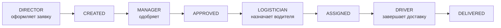
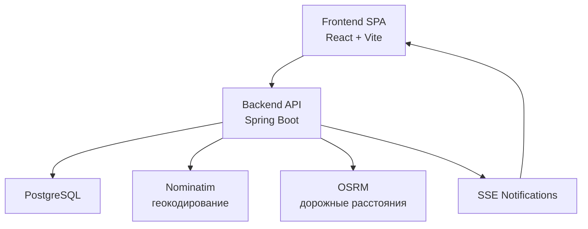

<div align="center">

# Farm Sales

### Автоматизация отдела сбыта фермерского хозяйства

Многоролевая B2B-система, которая проводит заказ через полный цикл:
**директор магазина → менеджер → логист → водитель**.

[](https://github.com/mkmacupe/farmer/actions/workflows/backend-tests.yml)
[](https://github.com/mkmacupe/farmer/actions/workflows/frontend-tests.yml)


[Живое демо](https://farmer.indevs.in) ·
[Технический обзор](docs/PROJECT_OVERVIEW.md) ·
[Сценарий защиты](docs/defense/demo-scenario.md) ·
[Транспортная задача](docs/defense/transport-task.md)

</div>

> [!IMPORTANT]
> Для защиты проект можно вернуть в эталонное состояние через `demo reset`.
> Это позволяет всегда показывать преподавателю одинаковый и предсказуемый сценарий.

## Содержание

- [Что это за проект](#что-это-за-проект)
- [Почему проект выглядит законченным](#почему-проект-выглядит-законченным)
- [Как работает система](#как-работает-система)
- [Транспортная задача](#транспортная-задача)
- [Архитектура](#архитектура)
- [Стек](#стек)
- [Быстрый старт](#быстрый-старт)
- [Demo reset](#demo-reset)
- [Демо-аккаунты](#демо-аккаунты)
- [Тестирование](#тестирование)
- [Структура проекта](#структура-проекта)
- [Документация](#документация)
- [Деплой](#деплой)

## Что это за проект

`Farm Sales` — это курсовой проект в формате прикладной информационной системы, а не просто набор CRUD-экранов.

Система покрывает реальный бизнес-процесс:

1. директор магазина оформляет заявку на поставку;
2. менеджер проверяет и одобряет заказ;
3. логист распределяет заказы по водителям;
4. водитель завершает доставку;
5. менеджер получает аналитику, аудит и Excel-отчёты.

## Почему проект выглядит законченным

| Сильная сторона | Что реализовано |
|---|---|
| Полный цикл заказа | `CREATED → APPROVED → ASSIGNED → DELIVERED` |
| Ролевая модель | `DIRECTOR`, `MANAGER`, `LOGISTICIAN`, `DRIVER` |
| Практическая ценность | Геокодирование, логистика, отчёты, аудит, SSE |
| Защита без хаоса | `demo reset`, публичное демо, готовые сценарии показа |

## Как работает система



Ключевые возможности:

- многоролевой доступ и раздельные рабочие пространства;
- каталог товаров и оформление заказов;
- управление адресами магазинов и координатами;
- автоназначение заказов между водителями;
- realtime-уведомления через SSE;
- аудит действий пользователей;
- Excel-отчёты и аналитика менеджера.

## Транспортная задача

Логистическая часть проекта реализована в backend и решает учебную транспортную задачу в несколько шагов:

1. выбираются все заказы в статусе `APPROVED`;
2. учитывается текущая загрузка трёх водителей;
3. заказы группируются по точкам доставки;
4. точки распределяются по машинам с учётом веса и объёма;
5. порядок остановок строится по ближайшей точке **по дорогам**, а не по прямой;
6. логист получает preview-план и может подтвердить его.

Короткое и отдельное описание вынесено сюда:

- [Транспортная задача для защиты](docs/defense/transport-task.md)

## Архитектура



Архитектурный стиль:

- frontend: SPA;
- backend: модульный монолит;
- база: PostgreSQL + Flyway;
- взаимодействие: REST API + JWT + SSE.

Подробности:

- [Runtime architecture](docs/architecture/runtime-architecture.md)

## Стек

### Backend

- Java 21
- Spring Boot 3.4.3
- Spring Data JPA + Hibernate 6
- Spring Security + JWT
- Flyway
- PostgreSQL 17
- Apache POI
- SSE

### Frontend

- React 19.1.1
- Vite 7.3.1
- Material UI 7
- Leaflet / React-Leaflet
- Fetch API

### Тестирование

- JUnit 5
- Mockito
- Vitest
- Playwright

## Быстрый старт

### 1. Клонирование

```bash
git clone https://github.com/mkmacupe/farmer.git
cd farmer
```

### 2. Подготовка окружения

```bash
cp .env.example .env
```

### 3. Запуск backend и PostgreSQL

```bash
docker compose up --build -d
```

### 4. Запуск frontend

```bash
cd frontend
npm install
npm run dev
```

### 5. Адрес приложения

- frontend: `http://localhost:5173`
- backend API: `http://localhost:8080/api`

Для Windows можно использовать:

```powershell
powershell -ExecutionPolicy Bypass -File .\start-dev.ps1
```

## Demo reset

Перед защитой или после серии тестов можно вернуть проект в каноническое состояние.

### Локально

```powershell
powershell -ExecutionPolicy Bypass -File .\scripts\demo-reset.ps1 -Base http://127.0.0.1:8080/api
```

### На публичном backend

```powershell
powershell -ExecutionPolicy Bypass -File .\scripts\demo-reset.ps1 -Base https://farm-sales-backend.onrender.com/api
```

Reset делает следующее:

- очищает накопленные заказы, аудит и уведомления;
- пересоздаёт demo-пользователей;
- восстанавливает каталог товаров;
- оставляет пустое стартовое состояние для защиты: `0` заказов и `0` точек доставки.

Полный сценарий показа:

- [Demo Scenario For Defense](docs/defense/demo-scenario.md)

## Демо-аккаунты

| Роль | Логин | Пароль |
|---|---|---|
| Director | `berezka` | `BrzK8r2pQ1` |
| Director | `kvartal` | `KvtT4n7xR2` |
| Director | `yantar` | `YntP6m9sL3` |
| Manager | `manager` | `MgrD5v8cN4` |
| Logistician | `logistician` | `LogS7q1wE5` |
| Driver | `driver1` | `Drv1A9k2Z6` |
| Driver | `driver2` | `Drv2B8m3Y7` |
| Driver | `driver3` | `Drv3C7n4X8` |

> [!NOTE]
> На бесплатном Render backend может засыпать после простоя. Во frontend уже добавлены retry-механизмы и корректное восстановление после cold start.

## Тестирование

| Что проверяется | Команда |
|---|---|
| Backend tests | `cd backend && mvn test` |
| Frontend unit tests | `cd frontend && npm run test:run` |
| Frontend build | `cd frontend && npm run build` |
| E2E role flows | `cd frontend && npm run test:e2e` |
| Live API smoke | `cd frontend && npm run test:e2e:live` |
| Сквозной smoke backend | `powershell -ExecutionPolicy Bypass -File .\scripts\smoke.ps1 -Base http://127.0.0.1:8080/api` |

## Структура проекта

```text
backend/    Spring Boot API, бизнес-логика, JPA, безопасность, отчёты
frontend/   React SPA, роли, карты, таблицы, realtime UI
docs/       архитектура, защита, диаграммы, RBAC, деплой
scripts/    smoke, demo reset, служебные утилиты
```

## Документация

| Документ | Назначение |
|---|---|
| [docs/PROJECT_OVERVIEW.md](docs/PROJECT_OVERVIEW.md) | общий технический обзор проекта |
| [docs/architecture/runtime-architecture.md](docs/architecture/runtime-architecture.md) | runtime-архитектура |
| [docs/security/rbac-matrix.md](docs/security/rbac-matrix.md) | роли и права доступа |
| [docs/defense/demo-scenario.md](docs/defense/demo-scenario.md) | порядок демонстрации на защите |
| [docs/defense/transport-task.md](docs/defense/transport-task.md) | краткое объяснение транспортной задачи |
| [docs/deploy/free-deploy-render-cloudflare.md](docs/deploy/free-deploy-render-cloudflare.md) | деплой на бесплатный хостинг |
| [docs/postman/farm-sales.postman_collection.json](docs/postman/farm-sales.postman_collection.json) | API-коллекция |

## Деплой

Текущая production-связка:

- backend: Render
- frontend: публичный домен `farmer.indevs.in`
- database: PostgreSQL

Конфигурация инфраструктуры:

- [render.yaml](render.yaml)
- [docs/deploy/free-deploy-render-cloudflare.md](docs/deploy/free-deploy-render-cloudflare.md)

---

Если открыть репозиторий с нуля, то для преподавателя или проверяющего достаточно трёх файлов:

1. [README.md](README.md)
2. [docs/defense/demo-scenario.md](docs/defense/demo-scenario.md)
3. [docs/defense/transport-task.md](docs/defense/transport-task.md)
